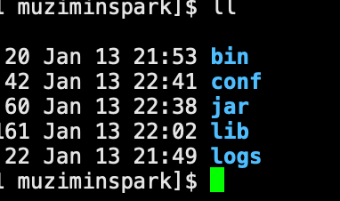
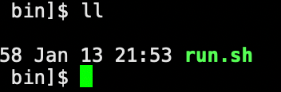
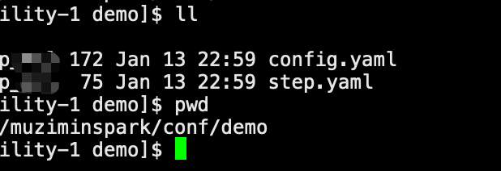
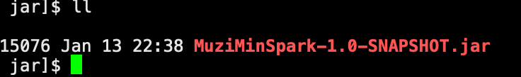
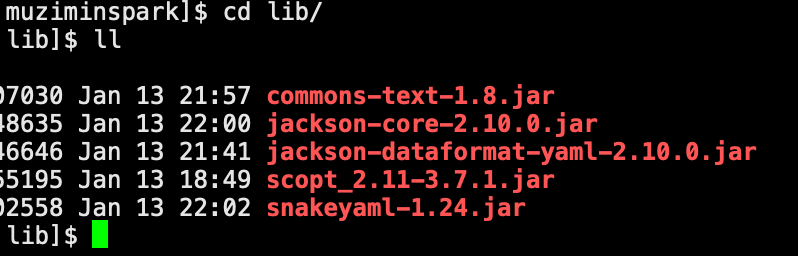

# MuziMinSpark  
  用于spark大数据开发框架，让开发人员更加注重业务逻辑，无需关注数据的读取，写入，只需在意dataframe/dateset之间的转换

# 如何在idea中运行示例代码
在本地运行时，需要将所有的文件的路径写成绝对/相对路径
1. VM options中添加
```yaml
-Dspark.master=local[*]
-Dspark.serializer=org.apache.spark.serializer.KryoSerializer
```
2. Program argument中添加配置文件的位置或者Json配置数据
```yaml
-c conf/config.yaml
或者
-j {"aaa":"bbb"}
```


3. 运行Job前需要指定两个文件，config.yaml以及step.yaml，因为在本地运行，所以指定文件路径的时候弄成相对路径或者绝对路径，可以让程序访问到即可

### 如何配置config.yaml（可以是其他名称，只需要是yaml文件即可）

1. 开头先指定好step.yaml的路径，相对路径或者绝对路径，step.yaml可以有多个，steps参数是必选项，如果没有，程序将退出

```yaml
steps:
  - conf/step.yaml
  - conf/step_2.yaml
```

2. 配置输入的数据源（目前只实现了file，hive）
   1. 配置输入源是csv文件，ratings是将csv转为DataFrame后注册的表名，该名称可任取；
   2. file表示该数据源类型是文件；
   3. path可以是一个文件的路径，也可以是一些文件所在的文件夹，该参数选型是必选的；
   4. format表示该文件的格式，可不填写，默认是csv格式；
   5. options表示读取该文件的配置项，比如csv文件是否将表头作为dataframe的schema，当读取csv文件时，默认的配置项是
      1. 逗号分隔符
      2. 字段存在双引号进行转义
      3. 用双引号作为包裹符号处理
      4. 对csv文件进行全包裹
      5. 将csv第一行数据作为DataFrame的表头

```yaml
inputs:
  ratings:
    file:
      path: examples/file_inputs
      format: csv
      options:
        delimiter: "\u0001"
        nullValue: "空值"
```

3. showPreviewLines，非必选值，默认是0；表示将处理后的DataFrame，show出来多少行

4. showQuery：是否将sql语句进行输出控制台；非必选值

5. cacheOnPreview：非必选值，表示是否将DataFrame进行缓存（该缓存级别是内存级）

6. variables：sql变量值，key-value类型，非必选项，如果配置了，那么就会在程序中进行设置

   ```yaml
   set $key = '$value'
   ```

   1. 比如设置时间戳等于多少

   ```yaml
   variables:
     mytimestamp: '1260759144'
   ```

7. appName：设置程序运行的名称，非必选项；默认值是MuziMinSpark

8. logLevel：设置spark的日志级别，非必选项；默认是INFO，可以选择的值有ALL, DEBUG, ERROR, FATAL, INFO, OFF, TRACE, WARN

9. 输出的配置项(目前只实现了输出到文件中的操作)

   1. 结果输出到文件中，dir是必选参数

      ```yaml
      output:
        file:
          dir: examples/file_outputs/op1
      ```
      
   2. 如果有多个输出方式，则可以定义outputs，如果获取则在step文件中进行定义

      ```yaml
      outputs:
        fileDir1:
          file:
            dir: examples/file_outputs/op2
        fileDir2:
          file:
            dir: examples/file_outputs/op3
      ```

      

10. config.yaml的完整样例

```yaml
steps:
  - conf/step.yaml

inputs:
  ratings:
    file:
      path: examples/file_inputs
      format: csv
      options:
        nullValue: "空值"

showPreviewLines: 10

showQuery: true

cacheOnPreview: true

variables:
  mytimestamp: '1260759144'

logLevel: WARN

appName: MuziMinSpark_V1.0

output:
  file:
    dir: examples/file_outputs/op1
    
outputs:
  fileDir1:
    file:
      dir: examples/file_outputs/op2
  fileDir2:
    file:
      dir: examples/file_outputs/op3
```

### 如何配置step.yaml文件

1. 以steps开始的数组

   1. dataFrameName：表示处理后注册得到的临时表，亦或者是UDF的名称
   2. sql：表示sql语句；
   3. file：表示sql所在的sql文件；
   4. classpath：表示继承com.muzimin.job.RichProcessJob的子类，该子类中可以使用代码进行数据操作；案例如下

   ```
   class Demo1 extends RichProcessJob {
     override def run(sparkSession: SparkSession, dataFrameName: String, params: Option[Map[String, String]]): Unit = {
   
       val myudf = udf(
         (column:String) => {
           column + "这是UDF产生的列"
         }
       )
   
       println("dataFrameName ====> " + dataFrameName)
   
       println(params)
   
       val df = sparkSession.table("ratings")
           .withColumn("userId_new",myudf(col("userId")))
   
       df.show(false)
   
       df.createOrReplaceTempView(dataFrameName)
     }
   }
   ```

   5. params：表示一些自定义变量，由key-value组成
   6. 定义将哪一个DataFrame输出，output下是一个数组，可以定义多个DataFrame进行输出，目前只实现了输出到文件的方式
      1. name：非必选项；表示配置文件outputs中定义的输出配置名称
      1. dataFrameName：这是必选项，名称是在steps中得到dataFrameName的名字或者配置文件中input得到的dataFrameName名字
      2. outputType：必选项，目前可选择Parquet, CSV, JSON, File这四种类型
      3. outputOptions：非必选项，定义一些文件的配置项，比如saveMode，format，repartition，partitionBy，extraOptions，path
      4. repartition: 非必选项，将DataFrame进行重分区，该参数也可放在outputOptions进行定义
   7. step文件的完成样例如下

```yaml
steps:
- dataFrameName: moviesWithRatings
  sql:
    SELECT userid,
           movieid,
           rating,
           timestamp,
           'demo' as title,
           '111' as genres
    FROM ratings
- dataFrameName: fantasyMoviesWithRatings
  sql:
    SELECT movieId,
           cast(rating AS float) AS rating,
           timestamp,
           title,
           genres
    FROM moviesWithRatings
- dataFrameName: topFantasyMovies
  file: examples/sqlFile/topFantasyMovies.sql

- dataFrameName: table3
  classpath: com.muzimin.job.mycode.Demo1
  params:
    param1: 20210101
    param2: 20220101
    
- dataFrameName: myFavoriteMovieRated
  sql:
    SELECT *,'测试环境变量' as test
    FROM moviesWithRatings
    WHERE timestamp = ${mytimestamp}
    
output:
  - dataFrameName: myFavoriteMovieRated
    outputType: File
    outputOptions:
      saveMode: Overwrite
      format: csv
      repartition: 2

  - name: fileDir1
    dataFrameName: table3
    outputType: File
    outputOptions:
      saveMode: Overwrite
      format: csv
      repartition: 2

  - name: fileDir2
    dataFrameName: table3
    outputType: File
    outputOptions:
      saveMode: Overwrite
      format: csv
      repartition: 2
```


# 如何在服务器上通过spark-submit提交任务
1. 程序打包方式

```shell script
mvn clean scala:compile compile jar:jar -DskipTests
```

2. 在任务目录下创建bin，lib，jar，logs，conf目录

   

   1. bin目录：存放脚本

      

   2. conf目录：存放配置文件

      

   3. jar目录：存在muziminspark程序包

      

   4. lib目录：存放第三方依赖以及自己的编写的代码包

      

   5. logs目录：存放作业生成的日志

3. 执行脚步案例(目前on yarn模式下，只有cluster起作用，如果client模式下起作用，需要更换另外一种读取方式，目前还在寻找适配两种模式下加载外部文件)

```shell
#!/bin/bash
base_dir=`pwd`

jobName=$1

jar_str=""
for jar in `ls ${base_dir}/lib/*.jar`
do
  jar_str=${jar_str},$jar
done

echo "拼接的jar包路径：${jar_str#*,} "

conf_str=""
for file in `ls ${base_dir}/conf/${jobName}/*`
do
  conf_str=${conf_str},${file}
done

echo "拼接文件的路径：${conf_str}"

concat_log(){
  echo ${base_dir}/logs/$1.log
}

spark2-submit \
--master yarn \
--deploy-mode cluster \
--jars ${jar_str} \
--files ${conf_str} \
--class com.muzimin.Application \
${base_dir}/jar/MuziMinSpark-1.0-SNAPSHOT.jar \
-c config.yaml \
> `concat_log ${jobName}` 2>&1

if [[ $? -eq 0 ]]; then
    echo "任务成功！"
else
    echo "任务失败。。。。"
fi
```

