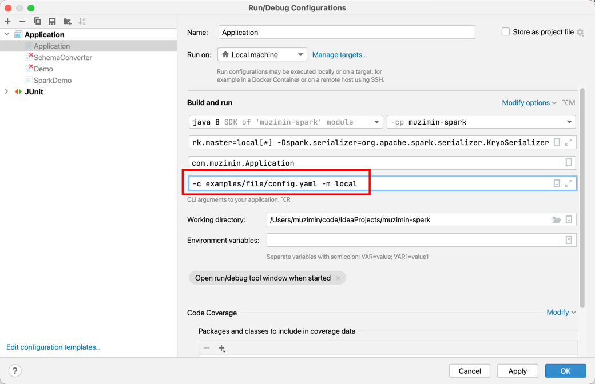

## 项目简介

muzimin-spark用于spark大数据开发框架，让开发人员更加注重业务逻辑，无需关注数据的读取，写入方式，只需在意dataframe/dateset之间的转换

# 版本说明
这是master分支默认版本，如果要适配环境中的版本，可以通过更改POM文件中的版本进行重新编译jar包，编译方式是
```text
mvn clean compile jar:jar
```

|   组件   |   版本   |
|:------:|:------:|
| Scala  | 2.11.8 |
| Hadoop | 2.6.0  |
|  Hive  | 1.1.0  |
| Spark  | 2.4.6  |
| Hutool | 5.7.7  |

# 快速上手
## spark-submit使用
* 编译好项目，得到muzimin-spark-${version}.jar
* 编写任务配置yaml文件，详细配置请查看配置文件章节，下面是一个读取文件，处理后输出到另外的文件的案例
```text
inputs:
  ratings:
    file:
      path: examples/file_inputs
      format: csv
      options:
        nullValue: "空值"

steps:
  - dataFrameName: moviesWithRatings
    sql:
      SELECT userid,
      movieid,
      rating,
      timestamp,
      'demo' as title,
      '111' as genres
      FROM ratings

outputConfs:
  fileDir1:
    file:
      dir: examples/file_outputs/op2

output:
  - name: fileDir1
    dataFrameName: moviesWithRatings
    outputType: File
    outputOptions:
      saveMode: Overwrite
      format: csv
      repartition: 2
```
* spark-submit提交编译好的包和yaml文件到yarn，进行Spark作业
```text
spark-submit \
--master yarn \
--deploy-mode cluster \
--jars ${jar_str} \    # 第三方依赖Jar包路径，通过逗号进行拼接本地绝对路径
--files ${conf_str} \  # 自己编写的yaml文件以及工作需要用到的SQL文件等
--name ${jobName} \    # 任务名称
--class com.muzimin.Application \
${base_dir}/jar/muzimin-spark-2.0.jar \
-c config.yaml \       # 自己编写的配置文件名称
```

## IDEA调试使用
* 将代码clone到本地IDEA中
```text
git clone https://github.com/MuziMin0222/muzimin-spark.git
```
* 编写任务配置yaml文件
* 配置命令行参数

* 然后执行com.muzimin.Application应用即可

# 配置文件说明