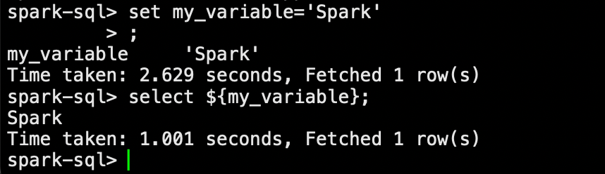

## 项目简介

muzimin-spark用于spark大数据开发框架，让开发人员更加注重业务逻辑，无需关注数据的读取，写入方式，只需在意dataframe/dateset之间的转换

# 版本说明
这是master分支默认版本，如果要适配环境中的版本，可以通过更改POM文件中的版本进行重新编译jar包，编译方式是
```text
mvn clean compile jar:jar
```

|   组件   |   版本   |
|:------:|:------:|
| Scala  | 2.11.8 |
| Hadoop | 2.6.0  |
|  Hive  | 1.1.0  |
| Spark  | 2.4.6  |
| Hutool | 5.7.7  |

# 快速上手
## spark-submit使用
* 编译好项目，得到muzimin-spark-${version}.jar
* 编写任务配置yaml文件，详细配置请查看配置文件章节，下面是一个读取文件，处理后输出到另外的文件的案例
```text
inputs:
  ratings:
    file:
      path: examples/file_inputs
      format: csv
      options:
        nullValue: "空值"

steps:
  - dataFrameName: moviesWithRatings
    sql:
      SELECT userid,
      movieid,
      rating,
      timestamp,
      'demo' as title,
      '111' as genres
      FROM ratings

outputConfs:
  fileDir1:
    file:
      dir: examples/file_outputs/op2

output:
  - name: fileDir1
    dataFrameName: moviesWithRatings
    outputType: File
    outputOptions:
      saveMode: Overwrite
      format: csv
      repartition: 2
```
* spark-submit提交编译好的包和yaml文件到yarn，进行Spark作业
```text
spark-submit \
--master yarn \
--deploy-mode cluster \
--jars ${jar_str} \      # 第三方依赖Jar包路径，通过逗号进行拼接本地绝对路径
--files ${conf_str} \    # 自己编写的yaml文件，工作需要用到的SQL文件，变量列表配置文件
--name ${jobName} \      # 任务名称
--class com.muzimin.Application \
${base_dir}/jar/muzimin-spark-2.0.jar \
-c config.yaml \         # 自己编写的配置文件名称
-v variable.properties \ # 可选参数，变量列表配置文件，可以在全局进行使用，该文件是可选，名称也可以自己指定
-d 20240716 \            # 可选参数，dt参数,可以在配置文件中通过${dt}进行调用
-p 2024-07-16            # 可选参数，parseDt参数，可以在配置文件中通过${parseDt}进行调用
```

## IDEA调试使用
* 将代码clone到本地IDEA中
```text
git clone https://github.com/MuziMin0222/muzimin-spark.git
```
* 编写任务配置yaml文件

* 配置命令行参数

  

* 然后执行com.muzimin.Application应用即可

# 配置文件说明

* 配置文件必须写的是steps，一个配置文件中没有step，任务会抛出异常

| 配置             | 说明                                                         | 类型                   |
| ---------------- | ------------------------------------------------------------ | ---------------------- |
| inputs           | 配置输入参数                                                 | Map[String,Input]      |
| steps            | 配置执行步骤                                                 | List[Step]             |
| variables        | 配置Spark任务引用的全局变量                                  | Map[String,String]     |
| outputConf       | 单个输出类型配置                                             | OutputConf             |
| outputConfs      | 多个输出类型配置，通过名称进行引用                           | Map[String,OutPutConf] |
| output           | dataframe要写出的地方，输出的配置可以某一个outputConf        | List[Output]           |
| catalog          | 目前只有Database一个配置项，指定Hive的数据库名称，也可以不指定，在SQL文件中进行databaseName.tableName进行操作 | Catalog                |
| cacheOnPreview   | 对输入和处理后的dataframe是否进行缓存                        | Boolean                |
| showQuery        | 是否对执行的SQL语句进行日志输出                              | Boolean                |
| logLevel         | 配置日志级别，但环境中的优先级会大于代码中配置的优先级，INFO，Warn，Error | String                 |
| appName          | 如果是yarn cluster模式提交任务，所以该设定Spark Dag中显示的名称，不是Yarn显示的名称，Yarn显示的名称需要通过spark-submit --name进行指定。如果任务是yarn client模式，那么该设定会在yarn上显示 | String                 |
| showPreviewLines | 是否对dataFrame进行输出，输出的行数进行指定                  | Int                    |

* 配置文件中可以引用的常量列表，在yaml文件中通过${变量名称}进行使用

| 变量名称         | 默认值                                                       |
| ---------------- | ------------------------------------------------------------ |
| dt               | 当前日期，如果通过-d传入，以外部传入的为准，yyyyMMdd格式     |
| parseDt          | 当前日期，如果通过-d传入dt，则会以传入的为准，yyyy-MM-dd格式 |
| tomorrowDt       | 当前时间的第二天日期，如果通过-d传入dt，则表示dt的第二天日期，yyyyMMdd格式 |
| yesterdayDt      | 当前时间的前一天日期，如果通过-d传入dt，则表示dt的前一天日期，yyyyMMdd格式 |
| tomorrowParseDt  | 当前时间的第二天日期，如果通过-d传入dt，则表示dt的第二天日期，yyyy-MM-dd格式 |
| yesterdayParseDt | 当前时间的前一天日期，如果通过-d传入dt，则表示dt的前一天日期，yyyy-MM-dd格式 |
| toYear           | 当前时间的年份，如果通过-d传入dt，则表示dt所在的年份，yyyy格式 |

## 数据源输入配置

* 配置中注册的dataframe名称，在相同的sparksession下，都是全局共享使用的。

## inputs配置

目前支持file，jdbc，hive

### file

```
inputs:
  ## 这个名称可以随意取
  sourceDF01:
    file:
      path: examples/file_inputs
      format: csv
      options:
        nullValue: "空值"
        
  sourceDF02:
    file:
      path: examples/file_inputs_01
      format: csv
```

### jdbc

其中这些变量，是通过变量配置文件进行设置的

```
inputs:
  sourceDF01:
    jdbc:
      connectionUrl: ${sqlserver.jdbc.url}
      user: ${sqlserver.jdbc.user}
      password: ${sqlserver.jdbc.password}
      table: tableName
      #非必选项
      options:
        driver: com.microsoft.sqlserver.jdbc.SQLServerDriver
        
  sourceDF02:
    jdbc:
      connectionUrl: ${mysql.jdbc.url}
      user: ${mysql.jdbc.user}
      password: ${mysql.jdbc.password}
      table: tableName
      #非必选项
      options:
        driver: com.mysql.cj.jdbc.Driver
```

### Hive

```
inputs:
  sourceDF1:
    hive:
      dbName: ods
      tbName: tbName
      columns: aaa,bbb,cccc
      condition: process_etl_date = '${parseDt}'
      
  sourceDF2:
    hive:
      dbName: ods
      tbName: tbName
      condition: etl_date = '${dt}'
```

## steps配置

* 目前支持的step配置有，sql，sql file，classpath

```
steps:
  ## dataFrameName是下面逻辑处理之后得到的dataFrame名称
  - dataFrameName: table0
    sql:
      SELECT userid,
      movieid,
      rating,
      timestamp,
      'demo' as title,
      '111' as genres
      FROM sourceDF1
      
  - dataFrameName: table1
    sql:
      SELECT movieId,
      cast(rating AS float) AS rating,
      timestamp,
      title,
      genres
      FROM sourceDF2
      
  - dataFrameName: table2
    ## 该SQL文件如果在本地执行，则传入相对路径/绝对路径
    ## 该SQL文件如果在yarn cluster执行，需要通过--files传入，并在file中传入文件名称
    file: topFantasyMovies.sql

  - dataFrameName: table3
    ## 传入自己定义的类的全路径，并将jar包通过--jars进行导入
    classpath: com.muzimin.job.mycode.Demo1
    params:
      param1: 20210101
      param2: 20220101
```

### 关于classpath的配置

* 自己的类继承com.muzimin.job.RichProcessJob，返回dataFrameName的名称，该名称可以是自己的dataFrame，也可以是定义的UDF名称。
* 定义dataFrame名称的操作

```
import com.muzimin.job.RichProcessJob
import org.apache.spark.sql.{DataFrame, SparkSession}
import org.apache.spark.sql.functions._

class Demo1 extends RichProcessJob {
  override def run(spark: SparkSession, dataFrameName: String, params: Option[Map[String, String]]): Unit = {
    val df = sparkSession.table("sourceDF1")
        .withColumn("userId_new",concat(col("userId"),lit("aaaa")))

    df.createOrReplaceTempView(dataFrameName)
  }
}
```

* 定义UDF操作，定义好之后可以在后续的step中进行直接使用

```
import com.muzimin.job.RichProcessJob
import org.apache.spark.sql.{DataFrame, SparkSession}
import org.apache.spark.sql.functions._

class DecrypFunction extends RichProcessJob{
  override def run(spark: SparkSession, dataFrameName: String, params: Option[Map[String, String]]): Unit = {
    spark.udf.register(dataFrameName, (column: String) => {
      column + "muzimin-spark"
    })
  }
}
```

## output配置

* 目前支持的输出类型有
  * Parquet
  * CSV
  * JSON
  * File,
  * Hive
  * JDBC
  * Upsert
* 下面以Hive，JDBC为例子

```
outputConfs:
  hiveout:
    hive:
      dbName: dw
      tbName: dw_table_a
      tbType: dynamic
      
  mysqlout:
    jdbc:
      connectionUrl: ${mysql.check.jdbc.url}
      user: ${mysql.check.jdbc.user}
      password: ${mysql.check.jdbc.password}
      driver: "com.mysql.cj.jdbc.Driver"
      truncate: true

output:
  - name: hiveout
    ## 这个dataFrameName是上面input/step得到的dataFrameName
    dataFrameName: table2
    outputType: Hive
    outputOptions:
      columns: "user_id string|open_id string"
      location: "hdfs://hacluster/user/hive/warehouse/dw.db/dw_table_1"
      partitions: dt string
      
  - name: mysqlout
    ## 这个dataFrameName是上面input/step得到的dataFrameName
    dataFrameName: table3
    outputType: JDBC
    outputOptions:
      saveMode: Append
      dbTable: mysql_table_name
```

## variables配置

* 设置了该配置，那么相当于在spark-sql中进行set操作，这是SparkSession下的全局变量，可以在一个任务下各个地方使用

```
variables:
  my_variable: 'Spark'
  my_variable: 'spark2'
```


